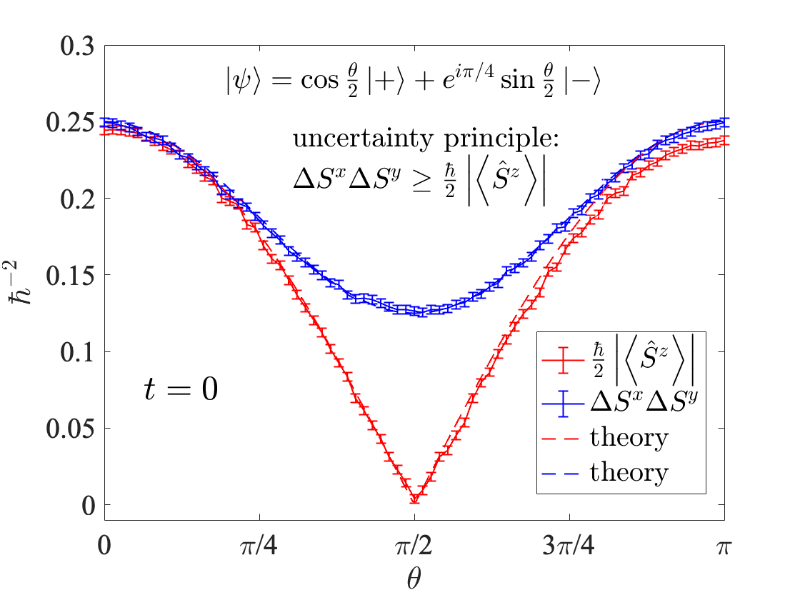

# Quantum Computing Tutorials for Topics in Introductory Quantum Mechanics

<p align="center">

  <i>Results shown from ```ibmq_bogota``` </i>v 1.4.49,<i> one of the IBM Quantum Falcon Processors)</i>
</p>

The notebooks on this repository were used in an undergraduate course on quantum mechanics (PHY 3310) at High Point University during the Fall 2021 semester. Completed notebooks are available in the [solutions](tutorials/solutions) folder.


- [Introduction to Single Spins](tutorials/01_IntroSingleSpins/01_IntroSingleSpin.ipynb)
- [Stern Gerlach Experiment](tutorials/02_SternGerlachExperiment/02_SternGerlachExperiment.ipynb)
- [Time Evolution](tutorials/03_TimeEvolution/03_TimeEvolution.ipynb)
- [Multiparticle Systems and Entanglement](tutorials/04_Entanglement/04_Entanglement.ipynb)
- [EPR Experiment and Bell's Inequality](tutorials/05_BellsInequality/05_BellsInequality.ipynb)

More detailed exposition on various activities is documented in my blog: [Theoretically Physics](https://theoreticallyphysics.wordpress.com/)

I acknowledge the use of IBM Quantum services for this work. The views expressed are those of the author, and do not reflect the official policy or position of IBM or the IBM Quantum team. Additionally, I acknowledge the access to advanced services provided by the IBM Quantum Educators Program.
